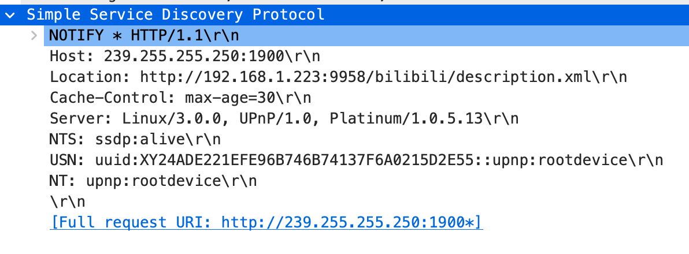
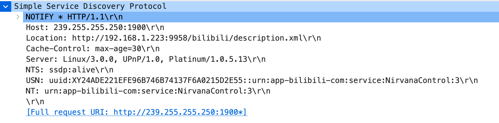
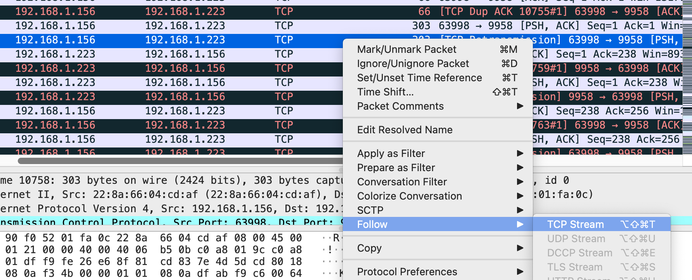
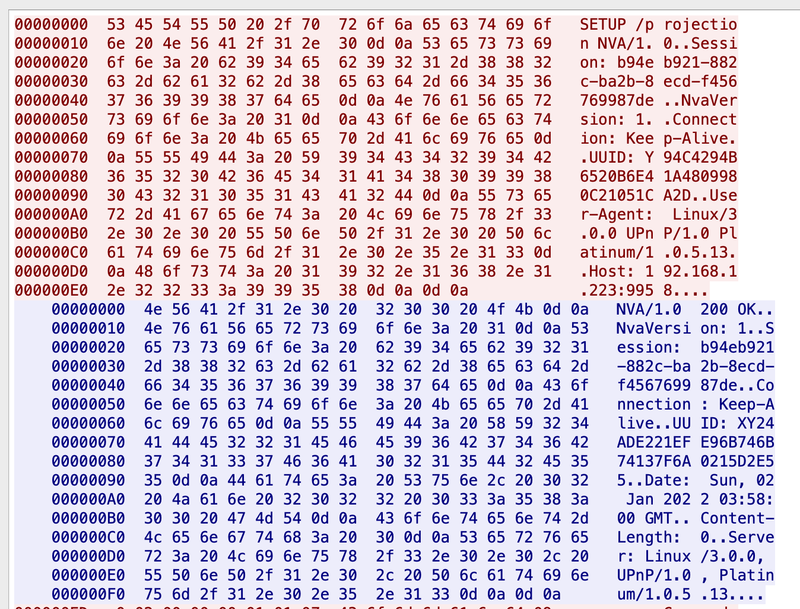
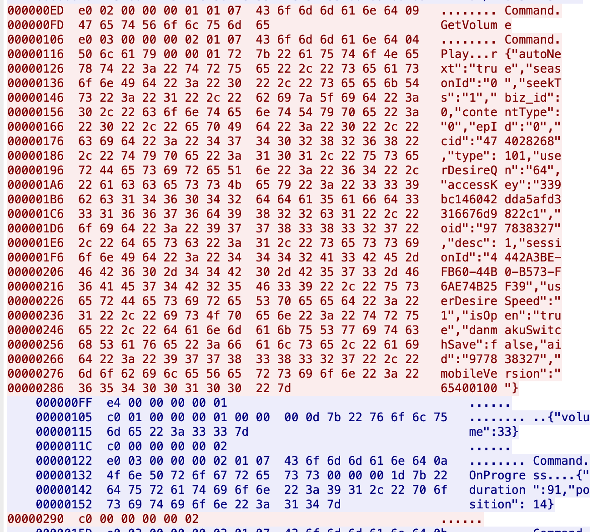

layout: post
title: 分析Bilibili客户端的“哔哩必连”协议
tags: [bilibili,dlna,python,mpv]
categories: python

---

## 前情提要

一直很希望有一个可以在电脑上接收DLNA投屏的软件，找了一圈最后找到了kodi，但是kodi不是很适合日常使用，因为他要求使用时软件全屏前置，这和我的需求完全不相同，我想要的是一个专注DLNA投屏，使用时可以悬浮小窗或者全屏播放，日常还可以隐藏在状态栏的简单轻量级的应用。

机缘偶合之下，看到了一篇DLNA协议的介绍，感觉用python实现一遍应该在我的能力范围之内，所以开始了尝试性的开发。后来程序不断完善分别在不同平台打包分发，变成了一个`PC端全平台的DLNA视频接收器` —— Macast。

> 说句题外话：如果让我重新来过一次，我可能会选择用go来开发，虽然相比python对我来说go写起来会慢一些，但是无论是软件大小还是多平台打包分发的能力都会更有优势，使用python会面临两个严重问题，那就是启动速度过慢与多平台打包会遭遇兼容问题（尤其是linux上很耗时间）。

再后来因为国内众多的视频软件开始仅仅对本家的TV客户端开放高清视频投放的权限，导致我日常用起来总是看不到高清的视频。所以微微重构了一下软件，让他支持通过插件的形式切换不同的协议，开发者仅仅关注协议实现的本身即可快速的实现一个对应平台的投屏接收器，这里的`哔哩必连`就是 Macast 对协议插件的第一次尝试。

`哔哩必连`是B站于2021年推出的专属投屏协议，他支持高清视频投屏与弹幕投屏，这正是我需要的内容，所以我开始了对这个协议的分析。

## 如何抓包

首先要讲一讲如何抓取协议数据，这个部分我要说的其实并不是唯一解，大家可以用各种自己喜欢的方式抓取数据。但是如果你暂时还没有头绪，或许可以尝试一下我说的办法。

首先我们需要两个智能设备，设备中必须有一个运行安卓系统，我们在其上安装`B站TV版`作为接收投屏的一端，另外一个设备安装支持`哔哩必连`的B站客户端。

>  软件的下载地址：https://app.bilibili.com

这里我使用了一个运行着openwrt的路由器搭配wireshark进行抓包，在路由器上运行tcpdump（虽然叫tcpdump但是udp数据也是可以抓取的），通过ssh实时传输抓包数据到电脑并输入到wireshark中，就能实现实时抓取路由器下任意一个设备的数据包（不过这种方式对有加密的数据貌似就无能为力了）。

```shell
# 一条命令抓取实时数据
ssh root@192.168.1.1 'tcpdump -i wlan1 host 192.168.1.223 -s 0 -l -w -' | /Applications/Wireshark.app/Contents/MacOS/Wireshark -k -i -
```

简单介绍一下上面shell的含义，首先通过ssh在路由器(192.168.1.1)上执行命令，命令内容为使用tcpdump抓包，tcpdump具体的指令含义大家可以查看相关的文档，这里我就不赘述了。然后通过管道将数据传输给wireshark实时显示出来。

要说明的是Fiddler和Charles这样的抓包工具在抓http的数据时候比较有用，但是我们要分析的数据不仅仅是http协议，还可能有其他应用层协议，不仅仅是tcp也可能是udp，所以wireshark在这种需求下非常有用。

除了在路由器上通过tcpdump抓包，还可以将TV端应用安装在安卓模拟器上，抓取模拟器的数据，不过这个方法对我来说用起来不如直接在路由器上抓包方便。

## 分析数据

先指明我的两个设备的ip地址，TV端地址：192.168.1.223，客户端地址：192.168.1.156

简单插一嘴，DLNA服务流程大致如下：服务向SSDP注册 -> 客户端通过SSDP发现服务 -> 客户端访问主体服务的xml描述 -> 客户端与主体服务交互。

 因为我们知道B站的小电视也可以接受标准DLNA投屏，所以我们对协议的分析也分别从这三个内容入手——SSDP、XML描述、协议交互数据

### SSDP协议

SSDP是DLNA协议中的服务发现协议，它使用UDP组播，发送HTTP Header格式的数据内容。

DLNA协议会在组播（239.255.255.250:1900）中发送类似如下的数据，用于通知局域网中的设备某地址存在可用的DLNA服务，客户端收到之后，就会访问Location中指定的描述文件地址，查看具体的服务内容：



其中NT与USN用于区分设备类型，一般来说DLNA Renderer会发送如下设备类型到组播。

```python
[
  f'uuid:{usn}::upnp:rootdevice',
  f'uuid:{usn}',
  f'uuid:{usn}::urn:schemas-upnp-org:device:MediaRenderer:1',
  f'uuid:{usn}::urn:schemas-upnp-org:service:RenderingControl:1',
  f'uuid:{usn}::urn:schemas-upnp-org:service:ConnectionManager:1',
  f'uuid:{usn}::urn:schemas-upnp-org:service:AVTransport:1'
]
```

通过分析数据，我们看到组播中收到了一条与众不同的内容：



很容易就分析到在SSDP这一部分 `f'uuid:{usn}::urn:schemas-upnp-org:service:AVTransport:1'`是B站专属的服务内容，并且其采用了与DLNA协议指定格式不同的uuid格式，由于这里服务名称为`NirvanaControl`所以后文中用NVA（nirvana）协议指代“哔哩必连”。

非常简单吧，已经完成了1/3。

## XML描述

DLNA使用XML来描述服务包含的功能与具体的接口定义等等，客户端在获取到服务的XML描述后就可以根据其定义的具体内容来访问对应的服务，早期NVA协议是通过扩展DLNA的XML描述的办法来实现定制功能的。

下一步我们尝试在电脑上访问SSDP header中Location指定的xml描述文件，看看和NVA协议标准DLNA有何不同。

```xml
<root xmlns:dlna="urn:schemas-dlna-org:device-1-0" xmlns="urn:schemas-upnp-org:device-1-0">
<specVersion>
  <major>1</major>
  <minor>0</minor>
</specVersion>
<device>
  <deviceType>urn:schemas-upnp-org:device:MediaRenderer:1</deviceType>
  <UDN>uuid:XY0000...</UDN>
  <friendlyName>我的小电视</friendlyName>
  <manufacturer>Bilibili Inc.</manufacturer>
  <manufacturerURL>https://bilibili.com/</manufacturerURL>
  <modelDescription>云视听小电视</modelDescription>
  <modelName>16s</modelName>
  <modelNumber>1024</modelNumber>
  <modelURL>https://app.bilibili.com/</modelURL>
  <serialNumber>1024</serialNumber>
  <X_brandName>Meizu</X_brandName>
  <hostVersion>25</hostVersion>
  <ottVersion>104600</ottVersion>
  <channelName>master</channelName>
  <capability>254</capability>
  <dlna:X_DLNADOC xmlns:dlna="urn:schemas-dlna-org:device-1-0">DMR-1.50</dlna:X_DLNADOC>
  <dlna:X_DLNACAP xmlns:dlna="urn:schemas-dlna-org:device-1-0">playcontainer-1-0</dlna:X_DLNACAP>
  <serviceList>...</serviceList>
</device>
</root>
```

可以注意到，除了uuid的格式不同外，NVA协议还在device的元素中添加了一些用于标识兼容性的内容，比如：capability，ottVersion等内容，后来经过测试如果不指定这些值会导致在某些版本的客户端上无法实现高清投屏。

friendlyName、manufacturer等内容也在客户端的判定范围内，如果不严格的指定这些值，会导致客户端将其对待为普通的DLNA renderer。

现在看起来区别还是很小的，让我们继续看一看 被折叠的 `serviceList`部分（为方便阅读简化了一下，不影响实际功能）。


```xml
<serviceList>
<service>
  <serviceType>urn:schemas-upnp-org:service:AVTransport:1</serviceType>
  <serviceId>urn:upnp-org:serviceId:AVTransport</serviceId>
  <controlURL>AVTransport/action</controlURL>
  <eventSubURL>AVTransport/event</eventSubURL>
  <SCPDURL>dlna/AVTransport.xml</SCPDURL>
</service>
<service>
  <serviceType>urn:schemas-upnp-org:service:RenderingControl:1</serviceType>
  <serviceId>urn:upnp-org:serviceId:RenderingControl</serviceId>
  <controlURL>RenderingControl/action</controlURL>
  <eventSubURL>RenderingControl/event</eventSubURL>
  <SCPDURL>dlna/RenderingControl.xml</SCPDURL>
</service>
<service>
  <serviceType>urn:schemas-upnp-org:service:ConnectionManager:1</serviceType>
  <serviceId>urn:upnp-org:serviceId:ConnectionManager</serviceId>
  <controlURL>ConnectionManager/action</controlURL>
  <eventSubURL>ConnectionManager/event</eventSubURL>
  <SCPDURL>dlna/ConnectionManager.xml</SCPDURL>
</service>
<service>
  <serviceType>urn:app-bilibili-com:service:NirvanaControl:3</serviceType>
  <serviceId>urn:app-bilibili-com:serviceId:NirvanaControl</serviceId>
  <controlURL>NirvanaControl/action</controlURL>
  <eventSubURL>NirvanaControl/event</eventSubURL>
  <SCPDURL>dlna/NirvanaControl.xml</SCPDURL>
</service>
</serviceList>
```

一般的DLNA投屏接受端会实现三个服务：AVTransport、RenderingControl、ConnectionManager，分别负责播放控制(播放暂停等主要功能)、播放器控制(比如音量调节等功能)和协议相关的信息服务。

可以看到，在这里NVA协议新增了一项服务：NirvanaControl

进一步访问 `{host}/dlna/NirvanaControl.xml` 可看到里面提供了如下方法：

```xml
<actionList>
<action>
<name>GetAppInfo</name>
<argumentList>...</argumentList>
</action>
<action>
...
</action>
</actionList>
```

后来通过对数据包的分析，发现这个列表中的内容应该是早期NVA协议实现的时候会用到的，当时采用的扩展DLNA协议的方式将定制化的功能说明放入XML中，但是现在的NVA几乎不使用这个XML描述中的访问了，所以我们可以直接忽视里面的内容。

也就是说，xml部分的内容也不多，重新实现的时候几乎只需要复制粘贴即可。

## 协议交互数据

如果是纯粹的DLNA，设备间交互是采用互相POST数据的办法进行的（接口通过上面提到的XML描述获取），NVA协议在此基础上还拓展了新的交互方式，采用了类似websocket的TCP长连接与客户端交互。

我们使用wireshark抓取TV端数据，然后再通过wireshark的过滤指令`ip.src == 192.168.1.156 or ip.dst == 192.168.1.156`在wireshark内将两个设备间的数据过滤出来。

通过分析数据可以看到两个设备间交互的数据均为TCP协议的数据，除了常规DLNA xml相关的访问之外，还有一些看似是乱码的TCP数据。



我们随便选择一条，右键跟随TCP流，这样我们就能够获取到单个连接的所有收发数据。



咱们先分析这条TCP链接的第一个交互数据，其中红色表示客户端发送的内容，蓝色是TV端返回的数据，可以看到其与HTTP/1.0的区别仅仅是将协议名改成了NVA/1.0，并且设置了 Keep-Alive 说明后面还会有其他数据等待接受或发送。

如果感觉分析的过程有点啰嗦，可以直接看后面我整理凝练的协议说明。

##### 1. 解密发送指令的结构

前面说到NVA协议是一个类似websocket的TCP长连接协议，那么上图中展示的这一步就相当于wensocket中的HTTP upgrade，让两个节点建立起了长连接，后面就开始命令数据的传送：



似乎大部分都是明文，这让人安心了不少。先看客户端发送的两个数据（上图红色）：

```assembly
000000ED  e0 02 00 00 00 01 01 07  43 6f 6d 6d 61 6e 64 09   ........ Command.
000000FD  47 65 74 56 6f 6c 75 6d  65                        GetVolum e

00000106  e0 03 00 00 00 02 01 07  43 6f 6d 6d 61 6e 64 04   ........ Command.
00000116  50 6c 61 79 00 00 01 72  7b 22 61 75 74 6f 4e 65   Play...r {"autoNe
...
00000286  36 35 34 30 30 31 30 30  22 7d                     65400100 "}

```

我们很容易看出来的是Command与GetVolume之间的一个字节是 0x09，9刚好是GetVolume这个命令语句的长度，而第二条数据中，Command后面的字节为0x04，也刚好是Play这个单词的长度，这意味着在Command后面跟随的一个字节表示了后面命令名称的长度。

经过计数，同理， Play 后面的四个字节，也正是其后json字符串的长度。以此类推Command前一个字节内容都为0x07，是这个Command单词本身的长度。

**所以我们现在对于Command相关的指令，得到了如下信息：一条命令可以分为两部分或三部分，第一个部分均为 Command，第二部分为命令的名称，第三部分为可选的json字符串。其中前两个部分开头由一个字节表示指令的长度，第三部分开头由四个字节表示json字符串的长度。**

下面只剩前七个字节需要分析了，为方便找规律，我们现在只关注前16个字节。

```assembly
000000ED  e0 02 00 00 00 01 01 07  43 6f 6d 6d 61 6e 64 09   ........ Command.
00000106  e0 03 00 00 00 02 01 07  43 6f 6d 6d 61 6e 64 04   ........ Command.
```

可以看到 第一个字节始终为 0xe0，第七个字节始终为 0x01，这两个暂时没有变化所以分析不出来。（后来分析发现这两个值在所有指令中都始终不变，我简单将0xe0理解为指令的标识，0x01猜测可能表示的是指令的版本）

**先看第二个字节，其分别为 0x02和0x03，正好对应了指令参数的数量，第一条有两个参数：Command和Play，第二条有三个参数：Command、GetVolume和json字符串** （肯定不是一下就分析出来的，是在看过了很多指令之后总结的规律）

然后看第三个字节开始的四个字节，第一条指令为 `00 00 00 01`，第二条指令为 `00 00 00 02` 再看看后面发送的指令，以此为 03、04，所以我们可以知道其代表的是指令的序列号。

##### 2. 如何发送指令的返回值

在客户端发送了两条指令后，TV回复了四段数据

```assembly
    000000FF  e4 00 00 00 00 01                                  ......
    
    00000105  c0 01 00 00 00 01 00 00  00 0d 7b 22 76 6f 6c 75   ........ ..{"volu
    00000115  6d 65 22 3a 33 33 7d                               me":33}
    
    0000011C  c0 00 00 00 00 02                                  ......
    
    00000122  e0 03 00 00 00 02 01 07  43 6f 6d 6d 61 6e 64 0a   ........ Command.
    00000132  4f 6e 50 72 6f 67 72 65  73 73 00 00 00 1d 7b 22   OnProgre ss....{"
    00000142  64 75 72 61 74 69 6f 6e  22 3a 39 31 2c 22 70 6f   duration ":91,"po
    00000152  73 69 74 69 6f 6e 22 3a  31 34 7d                  sition": 14}
```

紧接着，客户端又回复了如下的内容

```assembly
    00000290  c0 00 00 00 00 02                                  ......
```

咱们先分析TV端发送的内容，首先发了六个字节0xe4开头的数据，这个暂时含义不明，咱们之后分析。

然后发送了 c0 开头的数据，可以看到其后有volume字样的明文，所以不难猜测，这是对前面 GetVolume的返回值。

由前面分析的经验不难得到：**0xc0代表回复指令，其后一个字节表示参数的数量（为0或1），在之后四个字节表示回复指令的序号（与自身发送指令的序号无关），若参数数量标识为1，则再之后的四个字节表示参数的长度，最后参数长度个字节表示返回的json字符串。**

##### 3. 发送ping

前面出现了一条：`e4 00 00 00 00 01 ` 咱们一直无法分析出内容来，后面发现，每隔一秒，TV端都会向客户端发送类似的数据，所以推测出：此指令负责定时ping一下客户端，验证客户端还在线。

ping指令由0xe4开头，后面跟随 0x00 表示没有参数，再之后的四个字节表示当前的指令序号，由1起单调递增。


## NVA协议整理

以下协议内容为个人整理，仅供学习参考，不得用于非法用途。

### 协议头

##### 1. 客户端建立连接时发送

```http
SETUP /projection NVA/1.0
Session: {session}
NvaVersion: 1
Connection: Keep-Alive
UUID: {device-UUID}
User-Agent: Linux/3.0.0 UPnP/1.0 Platinum/1.0.5.13
Host: 192.168.1.223:9958
```

客户端device-UUID：同一设备唯一不变。

格式：Y + 35字节[0-1A-Z]，例如：Y12345ABCDE12345ABCDE12345ABCDE12345

session：可使用python自带模块 *uuid* 生成，例如：b94eb921-882c-ba2b-8ecd-f456769987de

Host：想要连接的TV端IP地址与端口（端口貌似一直是9958）

##### 2. TV端响应建立连接

```http
NVA/1.0 200 OK
NvaVersion: 1
Session: {session}
Connection: Keep-Alive
UUID: {device-UUID}
Date: Sun, 02 Jan 2022 03:58:00 GMT
Content-Length: 0
Server: Linux/3.0.0, UPnP/1.0, Platinum/1.0.5.13
```

TV端device-UUID：唯一不变：XY + 35字节[0-1A-Z]，例如：XY12345ABCDE12345ABCDE12345ABCDE12345

session：为客户端指定的session

##### 3. 客户端断线重连时发送

```http
RESTORE /projection NVA/1.0
Session: {session}
NvaVersion: 1
Connection: Keep-Alive
UUID: {device-UUID}
User-Agent: Linux/3.0.0 UPnP/1.0 Platinum/1.0.5.13
Host: 192.168.1.223:9958
```

参数定义不变，仅仅是将方法名改为了 RESTORE

##### 4. TV端响应断线重连

```http
NVA/1.0 200 OK
NvaVersion: 1
Session: {session}
Connection: Keep-Alive
UUID: {device-UUID}
Date: Sun, 02 Jan 2022 03:58:00 GMT
Content-Length: 0
Server: Linux/3.0.0, UPnP/1.0, Platinum/1.0.5.13
```

参数定义不变，内容与响应建立连接相同。

但是TV端会根据客户端发来的设备ID与session查找历史连接，如果找到session相同的历史连接，则需要通过后续交互发送当前的播放状态，包括进度、播放状态（暂停或播放等）、弹幕状态等等内容

如果找到了相同的设备ID但是session不同，则需要删除之前的连接。

### 命令结构

在建立起连接后，客户端与TV端直接通过TCP长连接互相发送数据。

##### 1. 指令

```assembly
# 例1
000000ED  e0 02 00 00 00 01 01 07  43 6f 6d 6d 61 6e 64 09   ........ Command.
000000FD  47 65 74 56 6f 6c 75 6d  65                        GetVolum e
# 例2
00000106  e0 03 00 00 00 02 01 07  43 6f 6d 6d 61 6e 64 04   ........ Command.
00000116  50 6c 61 79 00 00 01 72  7b 22 61 75 74 6f 4e 65   Play...r {"autoNe
...
00000286  36 35 34 30 30 31 30 30  22 7d                     65400100 "}
```

0xe0代表发送指令，其后一个字节表示参数的数量（为2或3），在之后的四个字节表示发送指令的序号（此序号由1起单调递增），再一个字节始终为0x01（有可能表示协议版本为v1），最后参数部分可以分为两部分或三部分，第一个部分均为 Command，第二部分为命令的名称，第三部分为可选的json字符串。其中前两个部分开头由一个字节表示指令的长度，第三部分开头由四个字节表示json字符串的长度。

##### 2.回复指令

```assembly
# 例1
c0 01 00 00 00 01 00 00  00 0d 7b 22 76 6f 6c 75   ........ ..{"volu
6d 65 22 3a 33 33 7d                               me":33}
# 例2
c0 00 00 00 00 02
```

0xc0代表回复指令，其后一个字节表示参数的数量（为0或1），在之后四个字节表示回复指令的序号（与自身发送指令的序号无关），若参数数量标识为1，则再之后的四个字节表示参数的长度，最后参数长度个字节表示返回的json字符串。

##### 3.ping

```assembly
# 例1
e4 00 00 00 00 01
# 例2
e4 00 00 00 00 02
```

TV端每隔一秒发送ping，ping指令由0xe4开头，后面跟随 0x00 表示没有参数，再之后的四个字节表示当前的指令序号，由1起单调递增。

### 客户端命令定义

##### 0. 一键登录

暂未抓取

##### 1. GetTVInfo/获取电视信息，此指令仅由安卓客户端调用，ios客户端不会调用

参数：无

返回值示例：暂未抓取

##### 2. GetVolume/获取音量

参数：无

返回值示例：{"volume": 30}

##### 3. SetVolume/设置音量

参数：{"volume": 30}

返回值：无

##### 4. Pause/暂停

参数：无

返回值：无

##### 5. Resume/继续播放

参数：无

返回值：无

##### 6. SendDanmaku/发送弹幕

参数：{'size': 18, 'mRemoteDmId': -1382023168, 'content': 'hello', 'action': '', 'type': 4, 'color': 16777215}

​	其中size 可选值范围：18,25,36

​	mRemoteDmId：表示弹幕的ID

​	content：弹幕内容

​	color: 十进制数字表示颜色，转为16进制字符串分别表示 RGB

​	type: 1:滚动字幕 5:上侧中央字幕 5:下侧中央字幕

弹幕需要在TV端登录账号后才能发送

返回值：无

##### 7. SwitchDanmaku/是否显示弹幕

参数：{"open": "true"} 或 {"open": "false"}

返回值：无

##### 8. SwitchSpeed/倍速

参数示例：{"speed": "1.5"}

返回值：无

##### 9. SwitchQn/切换清晰度

参数示例：{"qn": "120"}

返回值：无

##### 10. Stop/停止播放

参数：无

返回值：无

##### 11. Seek/变更进度（单位：秒）

参数：{"seekTs": 12}

返回值：无

##### 12. Play

参数：

```json
{
  "aid": "",
  "cid": "",
  "epid": "",
  "season_id": "",
  "oid": "", # epid不为0时为epid，为0时为aid
  "content_type": 1, # 未知含义
  "seekTs": 0, # 播放起始位置
  "access_key": "", # 可选，可用于获取会员高清视频或登录用户账号
  "current_qn": 112, # 可选，当前清晰度
  "desire_qn": 120, # 可选，用户选择的清晰度
  "danmakuSwitchSave": true, # 可选，切换视频时是否保持弹幕开启状态
  "userDesireSpeed": 1 # 可选，播放速度
}
```


返回值：无

##### 13. PlayUrl/设定播放url，此指令仅由ios HD版本客户端调用

参数：{"url": "", "title": ""}

​	通过读取url的nva_ext参数并解析json，获取视频的相关信息

nva_ext：{"ver": 2, "content": param}

​	param参数定义与Play指令的参数定义相同

返回值：无

### 客户端命令定义

##### 1. OnProgress/进度条改变（单位：秒）

发送数据：{"duration": duration, "position": position}

期待返回：无

##### 2. OnDanmakuSwitch/打开关闭弹幕

发送数据：{"open": true}

期待返回：无

##### 3. OnEpisodeSwitch/切换播放视频

发送数据：

```json
{
	"playItem": {
    "aid": self.aid,
    "cid": self.cid,
    "contentType": self.content_type,
    "epId": self.epid,
    "seasonId": self.season_id
  },
  "qnDesc": self.qn,
  "title": self.title
}
```

期待返回：无

##### 4. OnQnSwitch/切换清晰度

发送数据：当前为空时返回如下数据，否则应该返回正确的清晰度数据，数据可由 https://api.bilibili.com/x/tv/playurl 接口与获取播放链接时一并获取。

```json
{
	"curQn": 0,
  "supportQnList": [
    {
      "description": "",
      "displayDesc": "",
      "needLogin": False,
      "needVip": False,
      "quality": 0,
      "superscript": ""
    }
  ],
  "userDesireQn": 0
}
```

期待返回：无

##### 5. SpeedChanged/播放速度改变

发送数据：{"currSpeed": current_speed, "supportSpeedList": support_speed}

​	默认的倍速支持列表：[**0.5**, **0.75**, 1, **1.25**, **1.5**, 2]

期待返回：无

##### 6. OnPlayState/播放状态改变

发送数据：{"playState": 3}

```
3 加载中
4 播放中
5 暂停
6 媒体播放结束 end of file
7 停止
```

期待返回：无


### 协议行为

- 协议支持多台设备同时连接，当播放的状态改变时，会将当前播放的状态广播给所有连接的设备。
- 发送指令的序号是针对每个连接分别设置的，从1算起单调递增，发送指令和ping都会使其增加
- 当断线重连时，发送指令的序号重新设置为1
- 断线重连时，需要发送当前的播放状态
- 前面说的无返回值不是不返回，而是返回值参数为空
- 待补充


