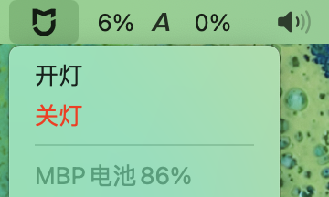
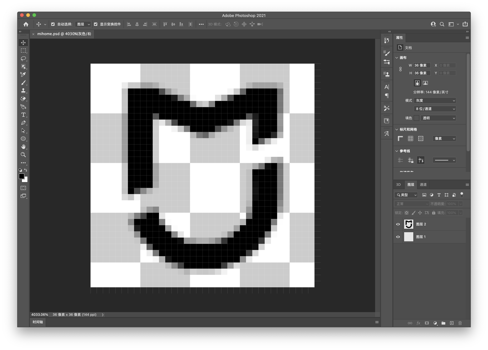
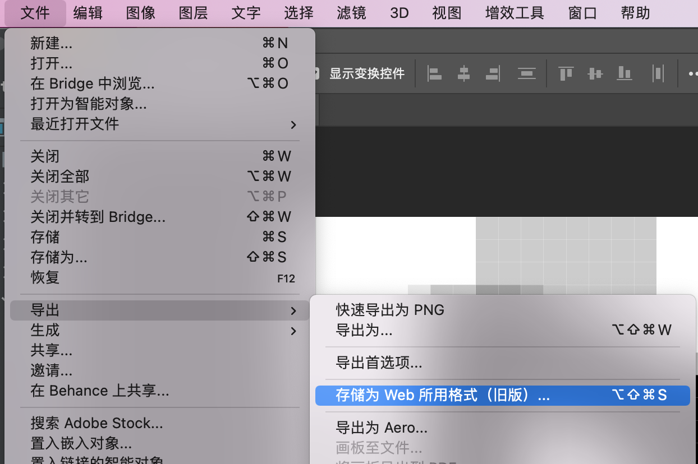
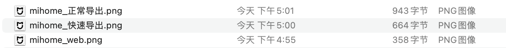
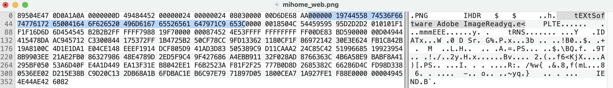
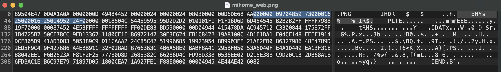

当你在将png图片转换为base64文本且需要保持144ppi时，你可能会需要这篇文章来尽可能降低你的图片大小。


## 前情

最近（有相当一段时间了）买了一个米家的智能插排，插孔是支持分控的，想用来搭配电脑实现 20%-80% 电量自动充电循环拯救一下被 “建议维修” 的mbp，最终结论是没啥用，不过过程很有趣，这里选取其中一部分分享一下折腾经验。

我的目的是用电脑来根据电量自动控制这个插排，但是电脑上并没有可以用于自动控制的米家客户端（或许m1的mac可以，但我不是），所以折腾着用python实现了一个简单的控制脚本，搭配xbar可以快速完成一个状态栏插件。

本来用文字做状态栏菜单的标题就可以了，但是追求完美的小方需要一个完美的米家图标显示在自己的状态栏；xbar支持在脚本中插入一个**144ppi的base64编码图片**作为状态栏图标，本来随便做一个就可以了，但是同样追求完美的小方想要同时兼顾观感体验与图片大小，因此有了这一期的图文，**如何做一个超小又不影响观感且分辨率是144ppi的png图片**。



## 操作过程

### 1. 制作图片

第一步很简单，我们用PS做一个`36x36`大小的米家图片，导出来。



有三种方式导出图片，`快速导出`、`导出为...`、`储存为Web所用格式`，以我的经验看最后一种方式导出的图片可以调整到最小，调整的方式有（png8格式、四色、不嵌入颜色配置文件、减少色彩种类）



三种方式导出的图片大小：



### 2. 删除无用字段

你以为已经调整到最小了嘛？我们使用`hex friend`打开刚刚生成的图片，看到其中的 `tExtSoftware Adobe ImageReady`字样了嘛，这是tExt字段，用来储存额外的信息，把它删掉即可，注意这个字段其实是由四部分组成：前四个字节表示数据长度、tExt表示数据块类型、可变长度的数据内容、四个字节的CRC（cyclic redundancy check）校验。



删掉之后，我们的图片大小从 358字节下降到了321字节。（我们也可以通过一些网站来解决，比如：https://tinypng.com）

### 3. 修改分辨率

难道这就结束了？NO！

PS导出的图片ppi为72，但是我们为了能让图片正常显示在状态栏需要144ppi，该怎么办呢？这时插入我们的神奇数据头到这张图片中。

```
00000009 70485973 00001625 00001625 01495224 F0
```



这个数据头就是用来配置自定义分辨率的，具体的含义大家可以根据png文件头的说明去分析，这里简单说一下，这段二进制串中关键的数据如下：

```
00001625 00001625 01
```

前面两个`1625`表示分别在长与宽方向1单位长度的像素数量，后面的`01`表示这里的1单位长度为1米，因为我们需要的是144ppi，1米约等于39.37英寸，简单做个乘法就是：144*39.37≈5669，转换为16进制就是 `0x1625`。


### 4. 转换base64

最后在网上找个网站转换把png图转成base64字符串：https://c.runoob.com/front-end/59/


## 最终结果

当然是还可以压的更小，但是再小放在macOS状态栏看就开始不清晰了。

```
data:image/png;base64,iVBORw0KGgoAAAANSUhEUgAAACQAAAAkBAMAAAATLoWrAAAACXBIWXMAABYlAAAWJQFJUiTwAAAAFVBMVEUAAAAAAAAAAAAAAAAAAAAAAAAAAAASAQCkAAAAB3RSTlMB/mWiL80ZQxWwKAAAALRJREFUKM+lkk0KwjAQhQd/sn/W7CW2rlPxAJHgvi0eQKr3P4PRPuyYLqT4bfL4SMJjGPmDlXOHTwrvsABsKYm+BRqqxFEkIuFHha6CVuSXKmskilKpnamALhitRGJ3ky/FqvYkmTI8qchURZ+r/fR7zFRso6pyprxFpqr3ecOI7RDWQBhSDZsFOQOe7zZUS8CGVKEGGirTAoVzySAIuYBsxj4tlZrbfTBXUUQugebxWp85PAFLWhtKWfFu3QAAAABJRU5ErkJggg==
```


## 参考资料

png文件格式介绍1：https://www.jianshu.com/p/e4a7eb127d53

png文件格式介绍2：https://blog.csdn.net/destiny1507/article/details/82942141

图片转base64：https://c.runoob.com/front-end/59/

缩小图片：https://tinypng.com
