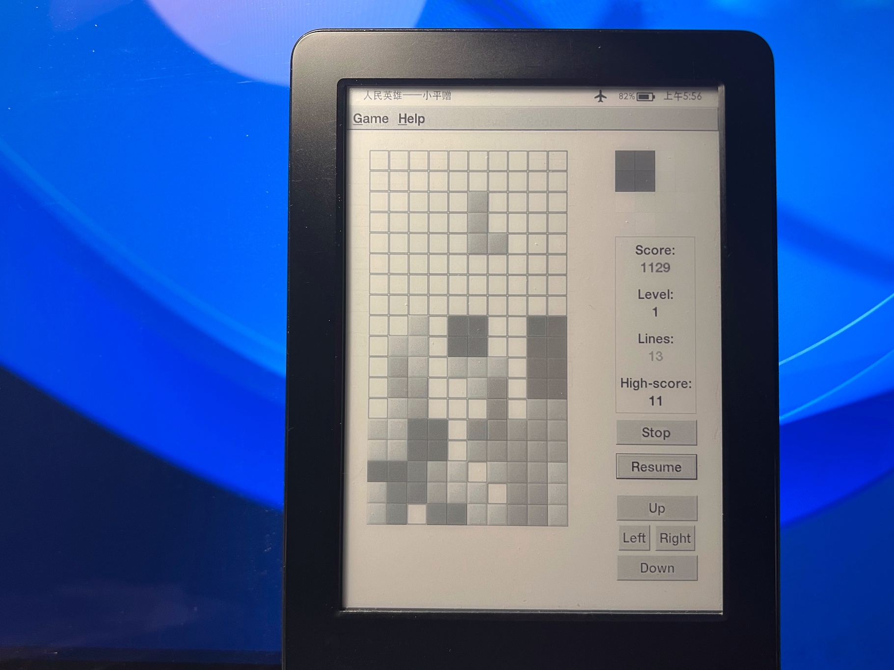

女朋友给我买了新的Kindle，于是终于可以甩开膀子自由玩耍我的老Kindle了！


## Kindle 越狱

大力感谢越狱作者：[**WatchThis - Software Jailbreak for any Kindle <= 5.14.2**](https://www.mobileread.com/forums/showthread.php?t=346037)

以及书伴网站的中文教程：[Kindle 通用越狱教程：适用固件版本 5.12.2.2~5.14.2](https://bookfere.com/post/970.html)

关于一个Kindle漏洞的详细发现过程：[**KindleDrip —** From Your Kindle’s Email Address to Using Your Credit Card](https://medium.com/realmodelabs/kindledrip-from-your-kindles-email-address-to-using-your-credit-card-bb93dbfb2a08)

推荐阅读最后一个文章，作者详细描述了一个发现漏洞、利用漏洞的一般流程，适合我们这些没啥技术力的程序员没事看看跟着沸腾。最终作者因此获得了亚马逊*18K$* 的奖励，也有人据此制作了越狱。


## 在越狱的Kindle上开发

不论是软件越狱还是硬件越狱，破解了我们的kindle后，我们就可以下载一些网友们自制的程序了。

和大火的psv与switch破解不同，kindle这边越狱虽然发展了十多年了但是并没有太多的自制软件，大部分的自制软件都有着近十年的历史，我想主要原因是Kindle这菜鸡性能也没什么好做的，大部分越狱的朋友都是冲着自定义锁屏页面去的，再加上kindle系统本身依托于linux，即使固件再三升级也不怎么影响系统底层。

所以这一份十年前(2012)写的kindle开发教程，在今天依旧不过期：[**here's how to compile a gtk native app for the kindle touch**](https://www.mobileread.com/forums/showthread.php?t=189372)

### 交叉编译

其实过程异常简单，只需要配置好arm32位交叉编译链然后把系统中预装好的库拷贝出来准备使用即可。编译出来的程序甚至都能运行在树莓派上。

为了避免手动编译交叉编译工具链，以及保持系统环境比较干净这里我做了一个简单的docker镜像来在我的mac上进行编译，Kindle上的glibc库比较老所以我们也需要用旧版本的gcc来编译，Dockerfile在此，大家也可以直接拉取我做好的镜像：`xfangfang/gcc-4.7-arm-linux-gnueabi`

```dockerfile
FROM ubuntu:trusty-20191217

RUN apt update &&\
  apt install -y gcc-4.7-arm-linux-gnueabi libgtk2.0-dev &&\
  cd /usr/bin &&\
  ln -s arm-linux-gnueabi-gcc-4.7 arm-linux-gnueabi-gcc &&\
  ln -s arm-linux-gnueabi-cpp-4.7 arm-linux-gnueabi-cpp &&\
  ln -s arm-linux-gnueabi-gcc-ar-4.7 arm-linux-gnueabi-gcc-ar &&\
  ln -s arm-linux-gnueabi-gcc-nm-4.7 arm-linux-gnueabi-gcc-nm &&\
  ln -s arm-linux-gnueabi-gcc-ranlib-4.7 arm-linux-gnueabi-gcc-ranlib &&\
  ln -s arm-linux-gnueabi-gcov-4.7 arm-linux-gnueabi-gcov

WORKDIR /src
```


### 来一份hello world吧

编译hello world比较简单，代码就不提供了，我们直接编译即可：

```shell
# 启动容器
docker run -it --rm -v `pwd`:/src xfangfang/gcc-4.7-arm-linux-gnueabi /bin/bash
# 容器内执行编译
arm-linux-gnueabi-gcc-4.7 hello_world.c -o hello_world
```

开发到这完全没有神秘感，编译出来的 `hello_world` 拷贝到kindle上，使用自制软件：Kterm 来执行即可。


### 那么怎么开发GUI呢？

kindle系统包中提供了GTK2的运行环境，虽然我之前做过一个gnome上的状态栏插件的gtk4.0适配，但完全是照葫芦画瓢。感觉gtk软件的一大问题就是不同大版本的gtk不兼容，我对gtk这种api不兼容的做法表示不理解，尤其是当你发现很多常用的api变动只是换了个名字的时候。（当然可能只是我对gtk的理解过于浅薄了）

Kindle上可以直接使用GTK2.0来开发，有一点小小的不同，就是窗口标题需要按照要求来设定，不然软件会不显示，要求如下：[Running_X_apps_on_Kindle_Touch](https://wiki.mobileread.com/wiki/Running_X_apps_on_Kindle_Touch)

这里我们使用那份十年前的教程中提供的代码即可正常运行：

```c
#include <gtk/gtk.h>

static void hello( GtkWidget *widget,gpointer data ) {
    gtk_main_quit ();
}

static gboolean delete_event( GtkWidget *widget, GdkEvent  *event, gpointer   data ) {
    g_print ("delete event occurred\n");
    return FALSE; // we do want to quit
}

static void destroy( GtkWidget *widget, gpointer   data ) {
    gtk_main_quit ();
}

int main( int   argc, char *argv[] ) {

    GtkWidget *window;
    GtkWidget *button;

    gtk_init (&argc, &argv);

    window = gtk_window_new (GTK_WINDOW_TOPLEVEL);
    g_signal_connect (window, "delete-event", G_CALLBACK (delete_event), NULL);
    g_signal_connect (window, "destroy", G_CALLBACK (destroy), NULL);
    gtk_container_set_border_width (GTK_CONTAINER (window), 10);

    GtkWidget *v_box_gamepad;
    v_box_gamepad = gtk_hbox_new(FALSE, 3);
    gtk_container_add (GTK_CONTAINER (window), v_box_gamepad);


    button = gtk_button_new_with_label ("Hello World");
    g_signal_connect (button, "clicked", G_CALLBACK (hello), NULL);
    // gtk_container_add (GTK_CONTAINER (window), button);
    gtk_box_pack_start (GTK_BOX (v_box_gamepad), button, TRUE, FALSE, 3);

    gtk_window_set_title ( GTK_WINDOW(window) , "L:A_N:application_ID:test");
    gtk_widget_show_all (window);

    gtk_main ();
    return 0;
}

```


在编译之前，我们还需要拷贝系统中关于gtk相关的动态库到我们的电脑上，这里为了省事可以全部考过来，拷贝时候比较消耗时间，所以大家要耐心等待。

越狱之后我安装了[koreader](https://github.com/koreader/koreader)，其中自带了ssh服务，所以这里我使用ssh直接拷贝了系统库，读者也可以使用Kterm手动备份 `/usr/lib` 目录到 `/mnt/us/` 下（这个目录是usb连接时的根目录），并通过usb复制文件到你的电脑上。

```shell
# Copy /usr/lib to this project
ssh -p <your_kindle_ssh_port> root@<your_kindle_ip> "cd /usr && tar -cpvzf /mnt/us/libs.tar.gz lib"
# It's a Upper "P" in "scp -P ..."
scp -P <your_kindle_ssh_port> root@<your_kindle_ip>:/mnt/us/libs.tar.gz `pwd`
tar -xzvf libs.tar.gz
```

然后直接进行编译即可

```shell
# 启动容器
docker run -it --rm -v `pwd`:/src xfangfang/gcc-4.7-arm-linux-gnueabi /bin/bash
# 容器内执行编译
arm-linux-gnueabi-gcc-4.7 hello_world_gui.c -o hello_world_gui `pkg-config gtk+-2.0 --cflags` -L/usr/arm-linux-gnueabi/lib -L/src/lib -lgtk-x11-2.0 -lgdk-x11-2.0 -lXrender -lXinerama -lXext -lgdk_pixbuf-2.0 -lpangocairo-1.0 -lXdamage -lXfixes -latk-1.0 -lcairo -lpixman-1 -lpng16 -lxcb-shm -lxcb-render -lX11 -lxcb -lXau -lXdmcp -lgio-2.0 -lpangoft2-1.0 -lpango-1.0 -lfontconfig -lfreetype -lz -lexpat -lgobject-2.0 -lffi -lgmodule-2.0 -lgthread-2.0 -lglib-2.0 -lstdc++
```


⚠️：前面docker镜像中的gtk库头文件版本为：2.24，但是kindle提供的gtk动态库为2.10，所以要注意不要不小心使用了高版本的api。


## 移植实战

简单移植了一个最初于1999年开发的俄罗斯方块，在github找到了一个适配了GTK2与GTK3的版本，简单调整了一下窗口大小与标题编译即可。

Gtihub repo: [gtktetris_kindle](https://github.com/xfangfang/gtktetris_kindle)

