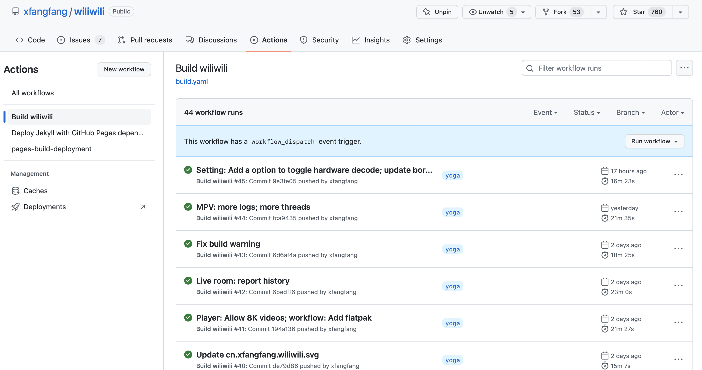
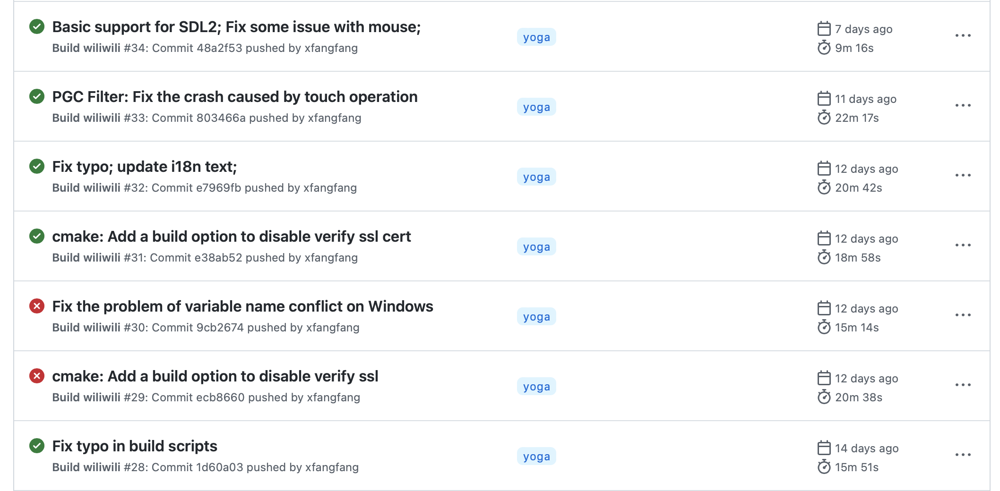
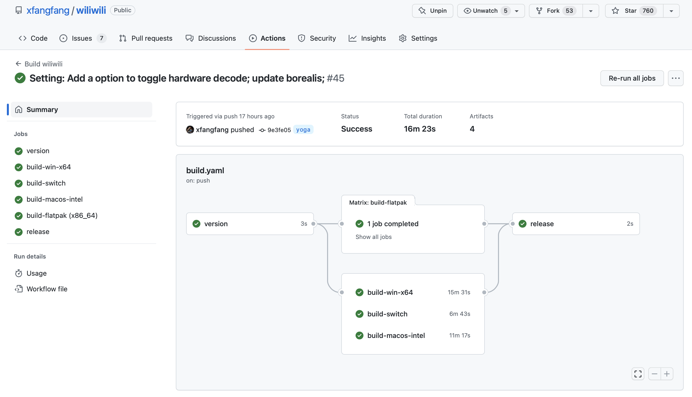
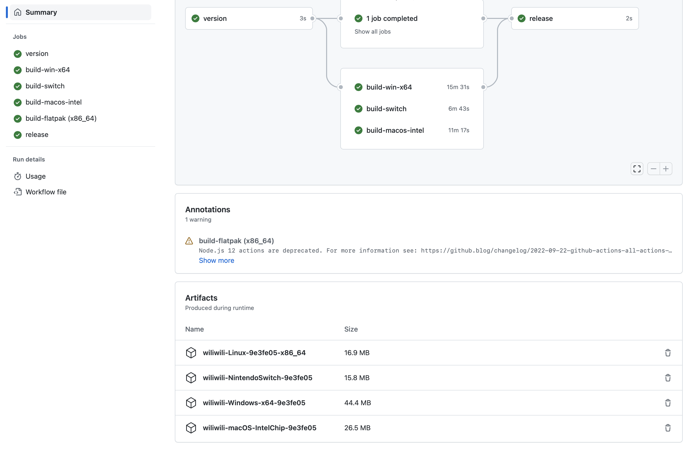

如果你不会在Github Actions下载编译结果，你可能需要先读读这个内容。

# 第一步：注册 Github 账号

这一步在 [Github 首页](https://github.com) 注册即可，你也可以点击 [这里](https://github.com/signup?ref_cta=Sign+up&ref_loc=header+logged+out&ref_page=%2F&source=header-home) 直达注册页面。

# 第二步：找到你要下载的构建结果

比如 这里展示了一个链接：[https://github.com/xfangfang/wiliwili/actions/workflows/build.yaml](https://github.com/xfangfang/wiliwili/actions/workflows/build.yaml)

点进去之后长这样：

你只需要关注右侧的列表就可以了，也就是：

在这个列表中，绿色代表编译成功，黄色表示正在编译，红色代表编译失败或部分编译失败。结论是，**点绿色的链接** 就可以了。

在这个列表中，**黑色加粗的文字内容** 表示这一次编译触发的原因，一般是对代码内容修改后触发的自动编译，所以这里会写着 **代码变更** 的简介。

**在这个列表中，最上面的是最新的编译结果，一般来说点击最上面绿色的链接即可。**

# 第三步，下载

点击上一步说的编译结果后，我们进入了这样一个页面：

如果你想了解编译的细节，可以点击这个页面上那些小绿点来检查编译过程中产生的log，**因为一切都是运行在云端且所有编译步骤可查，所以你大可以放心软件的安全性（至少我写的可以放心）**。

如果你只是想下载编译的结果，请滑到页面底部：

在底部，罗列了这一次编译的最终结果，按照你的需要点击下载即可。

**⚠️ 请注意如果你没有登录Github账号，在这里是无法点击下载的。**

# 总结反馈

使用Github Actions可以让开发者的每一次代码修改都能自动编译出测试版，虽然下载的步骤略微繁琐一些，不能直接点击下载，但是毕竟是免费的还能要求什么呢？

我的博客支持 Github 账号登录评论，如果你有任何问题欢迎点击下方评论栏登录你的 Github 账号来给我留言，你的每条留言我都会收到邮件提醒，所以最好一次性将要说的内容总结完毕，**在发布前站在旁白的角度思考一下留言的内容是否可以让别人看懂**，感谢。

